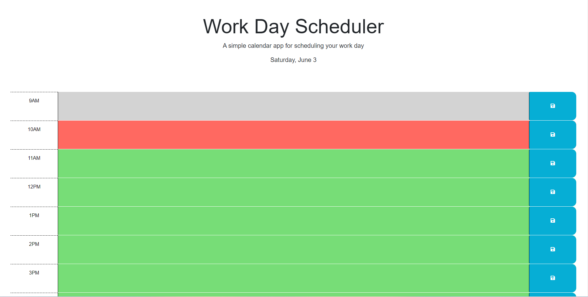

# Daily PLanner

## Features
The Week5 Daily Planner application offers the following features:

 * **Hourly Planning:** The application allows users to plan their activities hour by hour, providing a clear overview of their daily schedule.
 * **Task Management:** Users can easily add, edit, and delete tasks for each hour, enabling them to update their plans as needed.
 * **Persistent Storage:** The application utilizes local storage to save the user's schedule, ensuring that their data is preserved even after refreshing the page or closing the browser.
 * **Color Coding:** The time slots are color-coded to provide a visual representation of past, present, and future tasks, helping users stay organized and on track.

[Link to Live site](https://brendan-aper.github.io/Week5-daily-planner/)

[Link to Site Github](https://github.com/brendan-aper/Week5-daily-planner)

 ## Usage
 Here's a brief guide on how to use the Daily Planner:

  * Upon opening the application, you will see a table representing the hours of the day.
  * Each row corresponds to the hour, starting from 9 AM to 5 PM.
  * Click on a time slot to input or edit a task for that hour.
  * Once you have entered your task, click the save button to store it.
  * The time slots will be color-coded to indicate past, present, and future tasks.
  * To edit or delete a task, simply click on the respective time slot and make the desired changes.
  * The application automatically saves your schedule using local storage, so your data will persist even if you close or refresh the page.

  ## Credits

  The source code was providing by [The Coding Bootcamp](https://github.com/coding-boot-camp).

  Also help was given by my tutor Mathew Calimbas

  Check out my Github [Here](https://github.com/brendan-aper)

  ## License

  N/A